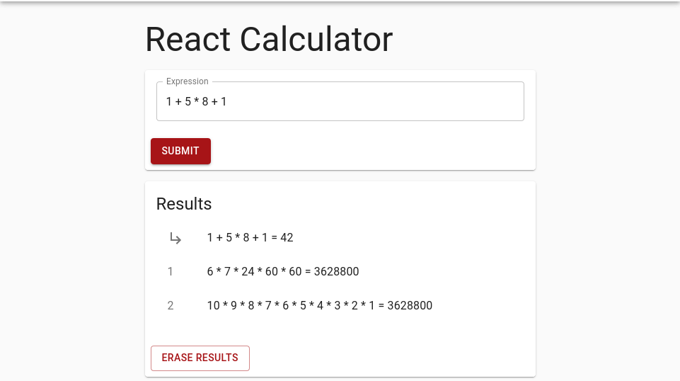
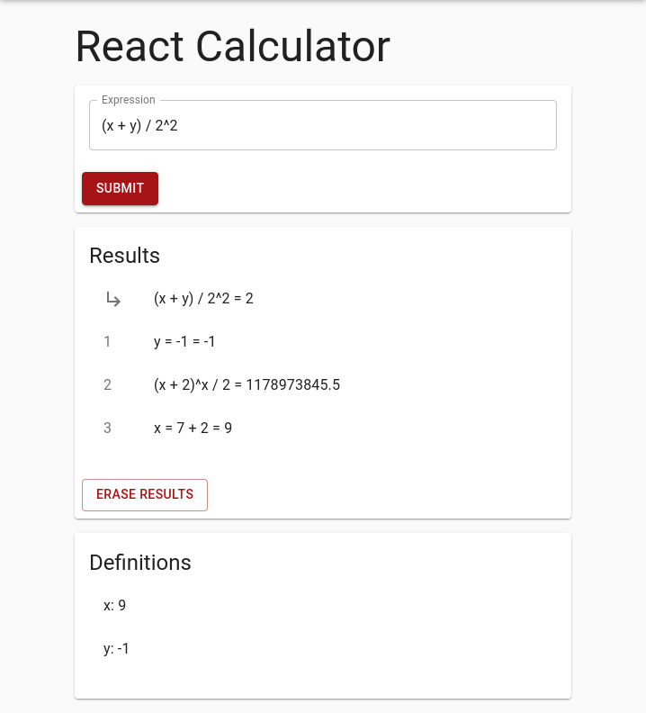

# Inline Calculator

## Introduction

This application uses the JavaScript framework React. It contains a skeleton of a front-end calculator app for inline calculation. 

### Expression Input and Results
The `ExpressionInput` component will trigger a calculation based on the value of its `TextField`. The result of the computation will be displayed in the `Results` component. Hint: consult the [`TextField` documentation ](https://material-ui.com/components/text-fields/#uncontrolled-vs-controlled) to learn how to react to text input in React components.

If the given expression is wrong or malformed return the 'Wrong input!' statement.
If the expression is correct, it will be displayed with its arguments and result separated by a space character. For example, the input *1.28+2.89*  will be rendered as *1.28 + 2.89 = 4.17*

### Show a History of Computations
Extend the application by adding a History component that displays the already calculated equations.  Hint: you can use the Material-UI [`List`-Component](https://material-ui.com/components/lists/#lists)

The results will be ordered with the newset entry as first element. Additionally it will be possible to clear the entire history using a clear button.

The following mock represents the expected result: 

